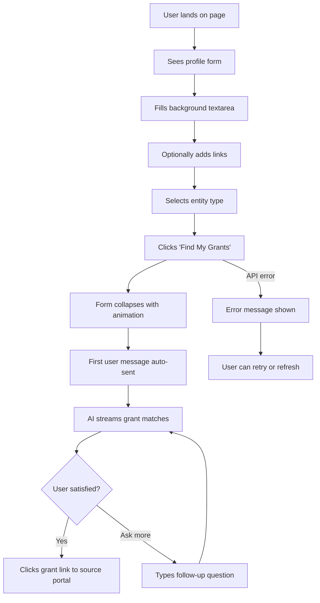
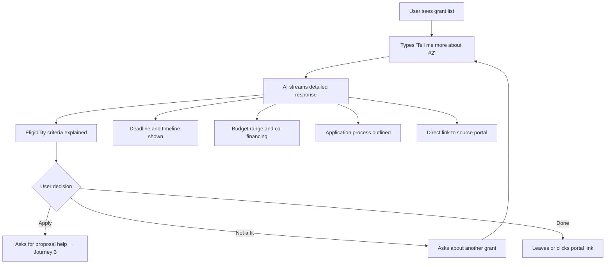
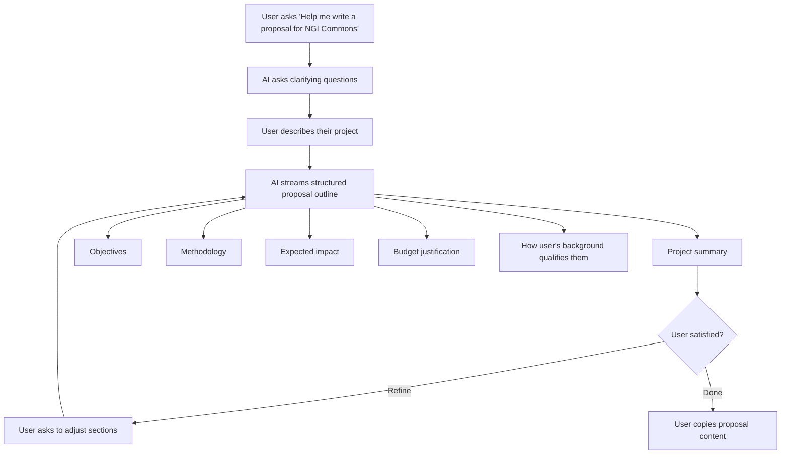

# UX Design Specification — OpenFundsEU

**Author:** rek
**Date:** 2026-01-31

---

## Executive Summary

### Project Vision

Single-page AI-powered platform that matches EU-based users to funding opportunities through conversation. User fills a profile form (background, links, entity type) → form collapses → AI suggests matching grants → user continues chatting for details, eligibility info, and proposal writing help. Built with Next.js 16.1 + shadcn/ui on Vercel, powered by Claude Opus 4.5 via OpenRouter.

### Target Users

EU-based individuals and entities seeking funding — freelancers (PFA), companies (SRL), NGOs, and academics. Likely moderate technical literacy; they understand their domain but need guidance navigating the fragmented EU funding landscape. Their core frustration: funding is scattered across dozens of portals and matching opportunities to their specific profile requires reading through each one manually.

### Key Design Challenges

- **Form → chat transition**: The moment the form collapses and chat appears is the critical UX inflection point. Must feel seamless and intentional, not jarring or confusing.
- **Trust & credibility**: EU funding is high-stakes. The interface must feel institutional and trustworthy — not like a casual chatbot toy.
- **Structured data in chat**: AI responses contain grants with links, budgets, deadlines, and proposal outlines. Markdown rendering must be clean and scannable, not walls of text.

### Design Opportunities

- **First impression = competence**: A clean, EU-branded form signals "this is a real tool" and builds instant trust before any AI interaction.
- **Progressive disclosure**: Form → grant suggestions → drill-down conversation follows a natural information hierarchy that reduces cognitive load.
- **Streaming as engagement**: Watching the AI stream suggestions creates a sense of active work being done, more engaging than a loading spinner.

## Core User Experience

### Defining Experience

The core experience is the ongoing conversation with the AI. The form is just the entry point — the real value happens when users interact with the AI to explore grants, ask about eligibility, understand deadlines, and get help drafting proposals. Every design decision should optimize for the quality and flow of this conversation.

### Platform Strategy

- **Web-only**, desktop-first (responsive but not mobile-optimized for MVP)
- **Mouse/keyboard primary** — users will be typing messages and clicking links
- **No offline needed** — AI requires network connectivity
- **Single page, no navigation** — everything happens in one view
- **Vercel hosting** — fast edge delivery, streaming support built-in

### Effortless Interactions

- **Form → chat transition**: User clicks "Find My Grants" → form collapses → AI starts streaming immediately. Zero dead time, no loading screen, no confusion.
- **Auto-send first message**: Profile data is formatted and sent as the first chat message automatically. User doesn't lift a finger between submitting the form and seeing results.
- **Clickable grant links**: Every grant suggestion includes a direct link to the source portal. One click to learn more externally.
- **Streaming responses**: Tokens appear progressively — user sees the AI working, not waiting behind a spinner.

### Critical Success Moments

- **First AI response**: The moment grants appear. If suggestions feel relevant and personalized, trust is established. If they feel generic, the user bounces.
- **First follow-up answer**: When the user asks "tell me more about #1" and gets a detailed, specific answer — this confirms the AI actually understands their profile.
- **Proposal help**: When the AI produces a structured proposal outline tailored to both the grant and the user's background — this is the "wow, this actually saves me hours" moment.

### Experience Principles

1. **Conversation is king** — the chat is the product, everything else serves it
2. **Zero friction entry** — form to first results with no dead time or confusion
3. **Trust through specificity** — every AI response must reference the user's actual profile and real grant data, never feel generic
4. **Progressive depth** — start with a list of matches, drill down through conversation, end with proposal outlines

## Desired Emotional Response

### Primary Emotional Goals

**Confidence** is the primary emotion — "I'm in the right place, this tool actually understands what I need." Every interaction should reinforce that the user is dealing with a competent, knowledgeable system backed by real data.

### Emotional Journey Mapping

| Stage | Desired Emotion | Design Implication |
|-------|----------------|-------------------|
| First visit (form) | Trust, competence | Clean EU-branded layout, institutional feel, no gimmicks |
| After submit (first AI response) | Relief + surprise | Relevant, personalized suggestions that prove the AI understood the profile |
| During conversation | Empowerment | User controls the depth — ask anything, drill down, pivot topics |
| Proposal help | Accomplishment | Structured, actionable output the user can actually submit |
| Error/failure | Calm, not panic | Clear message, no data lost, obvious recovery path |

### Micro-Emotions

- **Confidence > Confusion** — at every step, the user knows what's happening and what to do next
- **Trust > Skepticism** — real data, source links, deadlines, and budget ranges combat AI hallucination fears
- **Accomplishment > Frustration** — proposal outlines must feel specific and actionable, never generic filler

### Design Implications

- **Trust through data**: Every grant suggestion includes portal link, deadline, budget — verifiable facts that prove this isn't made up
- **Institutional aesthetic**: EU blue, clean typography, minimal decoration — signals "government-grade tool" not "startup toy"
- **Progressive complexity**: Start simple (form), escalate gradually (grant list → details → proposals) — never overwhelm
- **Error as reassurance**: Errors should feel handled, not broken. Clear language, no jargon, obvious next action

### Emotional Design Principles

1. **Credibility first** — every pixel should reinforce trust and institutional competence
2. **Data proves intent** — always show verifiable facts (links, deadlines, budgets) alongside AI responses
3. **Never overwhelm** — control information density at every stage
4. **Errors are conversations** — when things go wrong, communicate clearly and offer a path forward

## UX Pattern Analysis & Inspiration

### Inspiring Products Analysis

**ChatGPT / Claude.ai** — The standard for conversational AI. Clean message bubbles, streaming token display, markdown rendering (headers, lists, code blocks, bold). Key lesson: the chat container is the entire product — minimal chrome, maximum content space.

**Perplexity.ai** — Conversational search with inline source citations. Shows numbered references alongside AI text, clickable links to original sources. Key lesson: trust is built by showing where information comes from, not just the information itself. Directly applicable to showing grant portal links.

**Stripe / Linear** — Institutional-but-modern aesthetic. Clean typography, generous whitespace, muted color palette with strong accent colors. Key lesson: you can feel professional and trustworthy without feeling boring or bureaucratic.

### Transferable UX Patterns

**Chat Patterns (from ChatGPT/Claude):**
- Streaming token display — tokens appear word by word, creating engagement
- Markdown rendering in AI messages — headers, bold, lists, links render as rich text
- User messages visually distinct from AI messages (alignment, color, or background)
- Input area pinned to bottom, messages scroll above

**Trust Patterns (from Perplexity):**
- Inline source links within AI responses — every claim is verifiable
- Structured data blocks (deadline, budget, eligibility) alongside conversational text
- Clear attribution — user knows where the data comes from

**Aesthetic Patterns (from Stripe/Linear):**
- Strong primary color (EU blue #003399) used sparingly as accent, not everywhere
- White/light gray backgrounds with generous whitespace
- System font stack for speed, clean sans-serif feel
- Cards with subtle borders or shadows for content grouping

### Anti-Patterns to Avoid

- **Chatbot widget feel** — no floating bubble in corner, no "How can I help you?" generic opener. This is a full-page tool, not a support widget.
- **Wall of text responses** — AI must use markdown formatting. Unformatted paragraphs kill scannability.
- **Generic AI chrome** — no rainbow gradients, no sparkle icons, no "AI-powered" badges. Institutional users find this off-putting.
- **Hidden sources** — never present grant information without a direct link to the source portal. Unverifiable claims destroy trust.
- **Loading spinners for streaming** — if streaming works, show tokens appearing. A spinner before streaming starts should be minimal (subtle pulse, not a spinning wheel).

### Design Inspiration Strategy

**Adopt:**
- ChatGPT's chat container layout (messages above, input below, streaming)
- Perplexity's inline source citation pattern (grant links within AI text)
- Stripe's typography and whitespace approach (clean, professional, spacious)

**Adapt:**
- Claude.ai's form-to-chat pattern — we need a profile form that collapses, not just an empty chat. The transition is unique to us.
- Perplexity's structured data cards — adapt for grant summaries (title, deadline, budget, eligibility, link)

**Avoid:**
- Support chatbot widget aesthetics
- Overly playful/startup-y visual language
- Dense information layouts without breathing room

## Design System Foundation

### Design System Choice

**shadcn/ui** — a themeable, copy-paste component library built on Radix UI primitives and Tailwind CSS. Components are copied into the project (not imported from node_modules), giving full ownership and customization control.

### Rationale for Selection

- **Native to our stack** — built for Next.js + React + Tailwind, zero friction integration
- **Copy-paste ownership** — components live in our codebase, fully customizable without fighting a library
- **Accessibility built-in** — Radix UI primitives handle ARIA, keyboard nav, focus management
- **EU theme support** — CSS variables make it trivial to swap the default palette to EU blue (#003399) + white
- **Exact components available** — Card, ScrollArea, Input, Textarea, RadioGroup, Button are all we need for MVP

### Implementation Approach

- `npx shadcn@latest init` with custom theme configuration
- Install only needed components: Card, ScrollArea, Input, Textarea, RadioGroup, Button
- Override CSS variables for EU blue primary color and clean white backgrounds
- Components land in `components/ui/` — standard shadcn convention

### Customization Strategy

- **Color override**: Replace default slate/zinc palette with EU blue (#003399) as primary, white (#FFFFFF) as background, light gray (#F8F9FA) as secondary surface
- **Typography**: System font stack (Inter or similar clean sans-serif via `next/font`)
- **Spacing**: Keep shadcn defaults — they already follow generous whitespace patterns aligned with Stripe/Linear inspiration
- **No custom components for MVP** — shadcn primitives cover the form and chat container needs entirely

## Defining Experience

### Core Interaction

"Tell us about yourself, and we'll find your EU grants through conversation." The magic: fill a short form → get personalized, actionable grant matches instantly via streaming AI → continue the conversation for details and proposal help.

### User Mental Model

- **Current approach**: Google "EU grants for [my type]", open 10 tabs, read through each portal manually. Exhausting and overwhelming.
- **Expected experience**: "I tell you what I do, you tell me what fits" — like asking a knowledgeable colleague who knows every EU funding programme.
- **Potential confusion**: The form-to-chat transition. Users fill a form (structured input) and suddenly they're in a chat (freeform). Must feel like a natural progression, not two different products stitched together.

### Success Criteria

- First AI response appears within 2-3 seconds of form submit
- Grants listed are actually relevant to the profile (not generic)
- User asks at least one follow-up question (proves engagement)
- Source portal links are present in every grant suggestion

### Novel UX Patterns

- **Established**: Chat UI (universally understood), form submission (standard web) — no user education needed
- **Novel combination**: Profile form that collapses into conversational AI. Closest analogy: Perplexity's search bar → conversation, but with structured profile data first.
- **Key insight**: Both form and chat are universally understood. The novelty is combining them seamlessly — the transition is what we need to nail.

### Experience Mechanics

| Phase | What Happens | UX Detail |
|-------|-------------|-----------|
| **Initiation** | User lands on page, sees clean form | Textarea placeholder "I'm a freelance developer based in..." signals conversational input |
| **Interaction** | Fill background, add links, select entity type → click "Find My Grants" | Form collapses with animation → chat appears → first AI response streams immediately |
| **Feedback** | Streaming tokens show system working | Numbered grant list with deadlines/budgets/links = structured, verifiable results |
| **Completion** | No hard "done" state | User keeps chatting (drill into grants, request proposals) or leaves satisfied. Open-ended by design. |

## Visual Design Foundation

### Color System

| Role | Color | Hex | Usage |
|------|-------|-----|-------|
| **Primary** | EU Blue | #003399 | Buttons, links, active states, header accent |
| **Background** | White | #FFFFFF | Page background, chat container |
| **Surface** | Light Gray | #F8F9FA | Form card background, user message bubbles |
| **Border** | Gray | #E5E7EB | Card borders, input borders, dividers |
| **Text Primary** | Near Black | #111827 | Body text, headings |
| **Text Secondary** | Medium Gray | #6B7280 | Placeholders, labels, timestamps |
| **AI Message BG** | White | #FFFFFF | AI response bubbles (no background, or very subtle) |
| **User Message BG** | EU Blue Light | #EBF0FF | User message bubbles — light blue tint |
| **Success** | Green | #059669 | Open grant status badges |
| **Warning** | Amber | #D97706 | Upcoming deadline indicators |
| **Error** | Red | #DC2626 | Error messages, failed states |

Contrast ratios: EU Blue on white = 9.4:1 (AAA). Near Black on white = 17.4:1 (AAA). All pass WCAG AA minimum.

### Typography System

- **Font**: Inter via `next/font/google` — clean, professional, excellent readability
- **Scale**: Tailwind defaults (text-sm through text-3xl)
- **Headings**: Inter semibold (600), tracking tight
- **Body**: Inter regular (400), 16px base, 1.6 line height
- **Chat messages**: 15-16px for readability in conversational context
- **Monospace**: Not needed for MVP (no code blocks expected)

### Spacing & Layout Foundation

- **Base unit**: 4px (Tailwind default rem scale)
- **Layout**: Single centered column, max-width ~720px (chat-width, like Claude.ai)
- **Content density**: Spacious — generous padding on cards (p-6), comfortable gaps between messages (gap-4)
- **Form card**: Centered, padded, with subtle border — floats on the white page
- **Chat container**: Full remaining viewport height after form collapses, messages scroll within ScrollArea
- **Input area**: Pinned to bottom of chat container, always visible

### Accessibility Considerations

- All color pairs meet WCAG AA contrast (4.5:1 minimum for text)
- EU Blue on white exceeds AAA (9.4:1)
- Focus states: visible outline on all interactive elements (shadcn default)
- Keyboard navigation: Radix UI primitives handle this automatically
- Font size: 16px minimum base — no tiny text
- Touch targets: Not optimized for mobile in MVP, but buttons are minimum 36px height

## Design Direction Decision

### Design Directions Explored

Given the constraints (single-page form→chat, EU institutional branding, shadcn/ui components), the design space is intentionally narrow. The visual direction follows naturally from the decisions already made in previous steps rather than requiring exploration of divergent approaches.

### Chosen Direction

**"Institutional Chat"** — a clean, centered, single-column layout that transitions from a professional form card to a conversational AI interface.

**Form State:**
- Centered card (max-width 720px) on white background
- EU blue (#003399) "Find My Grants" button as the primary CTA
- Subtle border card with light gray (#F8F9FA) background
- Clean form fields: textarea for background, inputs for links, radio group for entity type

**Chat State:**
- Form collapses with smooth animation
- Small header bar showing "OpenFundsEU" branding
- Messages fill the viewport: AI left-aligned (white bg), user right-aligned (light blue #EBF0FF bg)
- AI messages render markdown (headers, bold, lists, links in EU blue)
- Input area pinned to bottom with "Send" button in EU blue
- ScrollArea for message history

### Design Rationale

- **Single direction, not multiple**: The product is a form + chat. The UI patterns are well-established (ChatGPT, Claude.ai). Exploring divergent layouts would be over-designing a solved interaction.
- **Institutional over creative**: EU funding audience expects clean, serious UI. Visual experimentation would undermine trust.
- **Component-driven**: shadcn/ui Card, ScrollArea, Input, Button — the components dictate the layout. Customization happens through color and spacing, not structural innovation.

### Implementation Approach

- Form card: shadcn `Card` with custom EU theme colors
- Chat messages: Custom div layout (no shadcn component needed — just styled divs)
- Message input: shadcn `Textarea` + `Button` in a fixed-bottom container
- Markdown rendering: `react-markdown` or similar for AI responses
- Transition animation: CSS transition on form card height (collapse to 0) + chat container fade-in

## User Journey Flows

### Journey 1: First-Time Grant Discovery

The primary flow — user arrives and gets matched to grants.

**Entry**: Direct URL (openfundseu.vercel.app)
**Time to value**: ~10 seconds (form fill) + ~3 seconds (AI response) = under 15 seconds to first grant suggestions
**Success signal**: Numbered grant list with real deadlines and portal links

### Journey 2: Grant Deep-Dive

User drills into a specific grant from the initial suggestions.

**Entry**: From Journey 1 results
**Success signal**: User gets enough info to decide whether to apply
**Key interaction**: Natural language question → structured, detailed AI answer

### Journey 3: Proposal Assistance

User wants help drafting a proposal for a specific grant.

**Entry**: From Journey 2 deep-dive
**Success signal**: Structured proposal outline that references both the grant requirements and the user's profile
**Key interaction**: AI asks clarifying questions before drafting (not generic output)

### Journey Patterns

- **Conversational progression**: Every journey flows through the same chat interface. No page changes, no navigation — just continued conversation.
- **Progressive depth**: List → detail → action. Each journey goes one level deeper.
- **AI-initiated structure**: AI uses markdown formatting to create scannable structure within conversational responses.
- **Escape hatches**: User can always pivot ("actually, tell me about a different grant") without losing context.

### Flow Optimization Principles

- **No dead ends**: Every AI response invites a next action (ask more, explore another grant, get proposal help)
- **Context preservation**: AI remembers the user's profile throughout — no need to re-explain background
- **Minimal steps to value**: Form → grants in under 15 seconds. No signup, no onboarding, no tutorial.
- **Error recovery is simple**: API error → clear message → user retries or refreshes. No data lost (form data is in React state, but conversations are ephemeral by design).

## Component Strategy

### Design System Components

**From shadcn/ui (used as-is or with minor EU theme overrides):**

| Component | Usage | Customization |
|-----------|-------|---------------|
| `Card` | Form container, wraps the profile form | EU surface color (#F8F9FA) bg, subtle border |
| `Input` | GitHub/LinkedIn/Website URL fields | Default styling, EU blue focus ring |
| `Textarea` | "Your Background" field | Taller default (4-6 rows), placeholder text |
| `RadioGroup` | Entity type selection (PFA/SRL/Individual/NGO/Academic) | Horizontal layout, EU blue selected state |
| `Button` | "Find My Grants" CTA, "Send" in chat | EU blue (#003399) primary variant |
| `ScrollArea` | Chat message container (scrollable) | Full height of remaining viewport |

### Custom Components

Only two custom elements needed — neither is complex enough to warrant a formal component library entry:

**1. ChatMessage (styled div)**
- **Purpose**: Render a single chat message (user or AI)
- **Variants**: `user` (right-aligned, light blue bg #EBF0FF) / `assistant` (left-aligned, white bg)
- **Content**: Plain text for user messages, rendered markdown for AI messages
- **States**: Streaming (tokens appearing) / complete
- **Implementation**: Simple div with conditional Tailwind classes, not a shadcn component

**2. ChatInput (Textarea + Button composition)**
- **Purpose**: Message input area pinned to bottom of chat
- **Content**: shadcn Textarea + Button composed in a flex container
- **States**: Empty (Send disabled) / has text (Send enabled) / sending (disabled + subtle loading)
- **Implementation**: Composition of existing shadcn components, not a new primitive

### Component Implementation Strategy

- **No custom component library** — MVP has 5 custom files total. Building a component library for 2 styled divs is over-engineering.
- **Inline in page.tsx** — ChatMessage and ChatInput are defined directly in the page component or as simple function components in the same file.
- **shadcn components used directly** — no wrappers, no abstractions. Import Card, use Card.

### Implementation Roadmap

**Single phase (MVP):**
1. Install shadcn components: Card, Input, Textarea, RadioGroup, Button, ScrollArea
2. Build profile form using shadcn primitives
3. Build chat UI with ChatMessage divs + ChatInput composition
4. Wire up `useChat` hook from Vercel AI SDK
5. Add `react-markdown` for AI message rendering

No phased rollout needed — the component surface is small enough to build in one pass.

## UX Consistency Patterns

### Button Hierarchy

| Level | Style | Usage |
|-------|-------|-------|
| **Primary** | EU blue (#003399) bg, white text, full width or auto | "Find My Grants" CTA, "Send" message button |
| **Disabled** | Gray bg, muted text, no cursor pointer | Send button when input empty, CTA during form submission |

Only two buttons exist in MVP. No secondary/tertiary/ghost variants needed.

### Feedback Patterns

**Streaming (AI responding):**
- Tokens appear progressively in the AI message bubble
- No separate loading indicator — the streaming IS the feedback
- Subtle cursor/blinking indicator at end of streaming text (optional)

**Error (API failure):**
- Red-tinted message bubble at bottom of chat: "Something went wrong. Try sending your message again."
- No modal, no toast, no banner — error appears inline in the chat flow
- User can simply type and send again

**Empty state (before form submission):**
- No empty state needed — user always sees the form first. Chat only appears after form submit.

**Message cap reached (20 messages):**
- Inline message in chat: "You've reached the conversation limit. Refresh the page to start a new session."
- Send button becomes disabled

### Form Patterns

**Validation:**
- Background textarea: required (minimum 10 characters). Show red border + "Please describe your background" on submit attempt
- Links: optional, no validation (URLs are freeform text)
- Entity type: required radio selection. If not selected on submit, show "Please select your entity type"
- Validation happens on submit click only (no inline validation while typing — it's a short form)

**Submit behavior:**
- Button shows "Finding your grants..." with disabled state during submission
- Form collapses with CSS height transition (300ms ease)
- Chat container fades in simultaneously

### Loading States

**Initial page load:** Instant — static form, no data fetching needed
**After form submit:** Form collapses → first AI message starts streaming within 2-3 seconds
**Between messages:** User types → hits Send → AI response starts streaming. No loading indicator between — streaming starts fast enough that a spinner would flash and disappear.
**Slow response (>5s):** Show a subtle "Thinking..." text below the last message. Remove when streaming begins.

## Responsive Design & Accessibility

### Responsive Strategy

**Desktop-first, not mobile-optimized for MVP.** The primary audience uses desktop browsers to research and apply for EU funding. Mobile optimization is explicitly out of scope.

**Desktop (1024px+):** Full experience — centered 720px column, comfortable spacing, all features.
**Tablet (768-1023px):** Functional — same layout, column narrows naturally. Form and chat remain usable.
**Mobile (<768px):** Basic — single column stacks naturally via Tailwind responsive. Usable but not optimized. No specific mobile patterns designed.

### Breakpoint Strategy

- **Tailwind defaults**: sm (640px), md (768px), lg (1024px), xl (1280px)
- **Primary design target**: lg (1024px+) — desktop
- **Max-width container**: 720px centered — works naturally on all screens above 768px
- **Below 768px**: Content fills full width with padding. No layout changes needed — single column already stacks.
- **No custom breakpoints** — Tailwind defaults are sufficient for a single-column layout

### Accessibility Strategy

**WCAG AA compliance** — the industry standard. Achieved mostly for free through shadcn/ui + Radix primitives.

**What we get automatically from shadcn/Radix:**
- Keyboard navigation on all interactive elements (RadioGroup, Button, Input)
- ARIA labels and roles on form controls
- Focus ring visibility on all focusable elements
- Proper form labeling and error association

**What we add manually:**
- Semantic HTML: `<main>`, `<form>`, `<section>` for chat area
- `aria-live="polite"` on the chat message container (announces new AI messages to screen readers)
- `aria-label` on the Send button and form submit button
- Skip to content link (minimal effort, good practice)
- `lang="en"` on `<html>` element

### Testing Strategy

**MVP testing (minimal):**
- Chrome, Firefox, Safari on desktop — manual check
- Lighthouse accessibility audit (automated, catches obvious issues)
- Keyboard-only navigation test (tab through form, submit, type in chat, send)

**Not in MVP:**
- Screen reader testing (VoiceOver, NVDA)
- Mobile device testing
- Color blindness simulation
- Performance testing on slow networks

### Implementation Guidelines

- Use semantic HTML elements (`<main>`, `<form>`, `<section>`) not generic `
` soup
- All form inputs must have associated `<label>` elements
- Chat container gets `role="log"` and `aria-live="polite"` for screen reader announcements
- Images (if any) need `alt` text — but MVP has no images
- Focus management: after form collapse, focus should move to the chat input automatically
- All interactive elements must be reachable via Tab key
